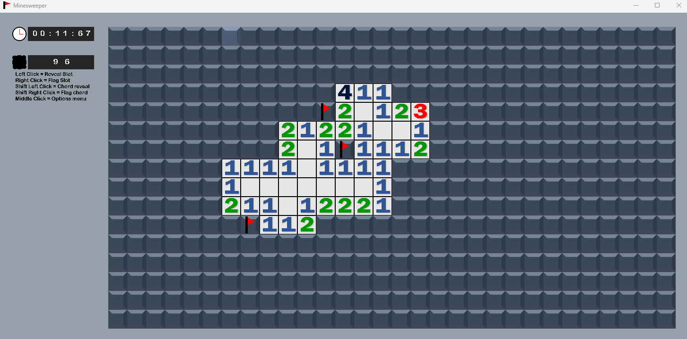

# minesweeper in C++ by thegur90 

A classic Minesweeper game built in C++ with SDL2.

1. Install SDL2, SDL2_image
2. `mkdir build && cd build`
3. `cmake ..`
4. `make` (or build with your IDE)

## Controls

- Left click: Reveal tile
- Right click: Flag tile  
- Shift + Left click: Chord reveal
- Shift + Right click: Auto-flag
- Middle click: Options
